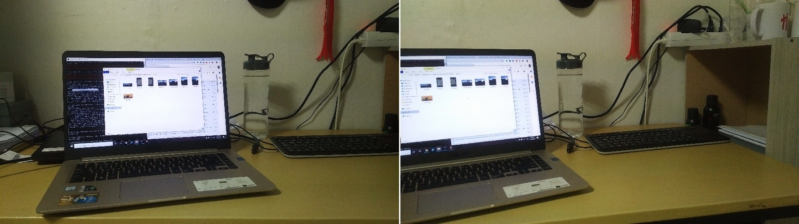
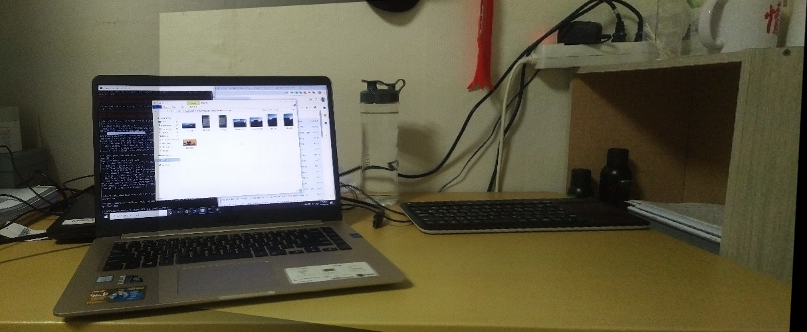
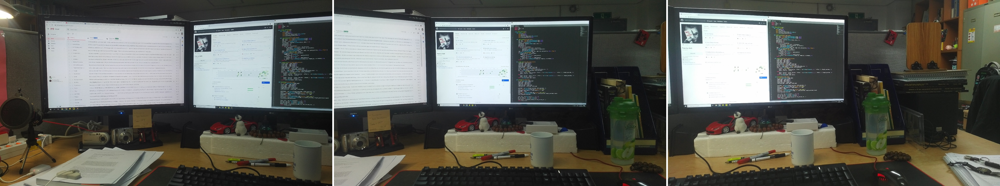

# Image Panorama Stitching
The repository is for Panorama Images Stitching Project.

## Requirements
- Python 3
- python-opencv-contrib <= 4.2.1.16

## Note
SIRF is no longer available in opencv > 3.4.2.16, you should choose older versions of opencv-python and opencv-contrib-python, the issue can be solved by using the following command lines:
```bashrc
python -m pip install opencv-python==3.4.2.16
python -m pip install opencv-contrib-python==3.4.2.16
```
Or just execute:
```bashrc
python -m pip install -r requirements.txt
```
## Usage
The application can be run by executing: 
```bashrc
python panorama.py "left_image_path" "right_image_path"
```
Example:
```bashrc
python panorama.py images/left.jpg images/right.jpg
```
## Results
### 1. 2-Image Panorama
- Inputs: Left and right images



- Output:



### 2. 3-Image Panorama
- Inputs: 3 images



- Output:


Nov. 2019

Tran Le Anh
