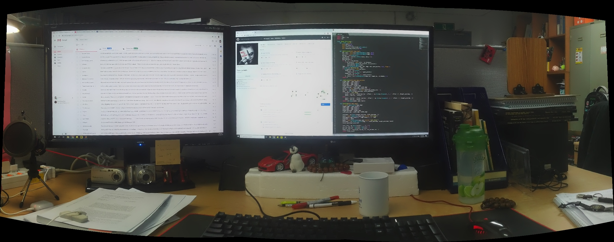

# Image Panorama Stitching
## Requirements
- Python 3
- python-opencv-contrib <= 4.2.1.16

## Note
SIFT is no longer available in opencv > 3.4.2.16, you should choose older versions of opencv-python and opencv-contrib-python, the issue can be solved by using the following command lines:
```bashrc
python -m pip install opencv-python==3.4.2.16
python -m pip install opencv-contrib-python==3.4.2.16
```
Or just execute:
```bashrc
python -m pip install -r requirements.txt
```
## Usage
### 1. 2 Images Only (panorama.py)
The application can be run by executing: 
```bashrc
python panorama.py "left_image_path" "right_image_path"
```
Example:
```bashrc
python panorama.py images/left.jpg images/right.jpg
```
### 2. Multiple Images (multi_image_pano.py: >= 2 images)
The application can be run by executing: 
```bashrc
python multi_image_pano.py --images "folder-containing-images-path" --output "output-file"
```
Example:
```bashrc
python multi_image_pano.py --images images/3_images --output 3_img_pano.jpg
```
## Results
### 1. 2-Image Panorama
- Inputs: Left and right images


- Output:


### 2. 3-Image Panorama
- Inputs: 3 images


- Output:


## References
1. https://github.com/linrl3/Image-Stitching-OpenCV
2. https://www.pyimagesearch.com/2018/12/17/image-stitching-with-opencv-and-python/
3. https://medium.com/pylessons/image-stitching-with-opencv-and-python-1ebd9e0a6d78

Nov. 2019

Tran Le Anh
